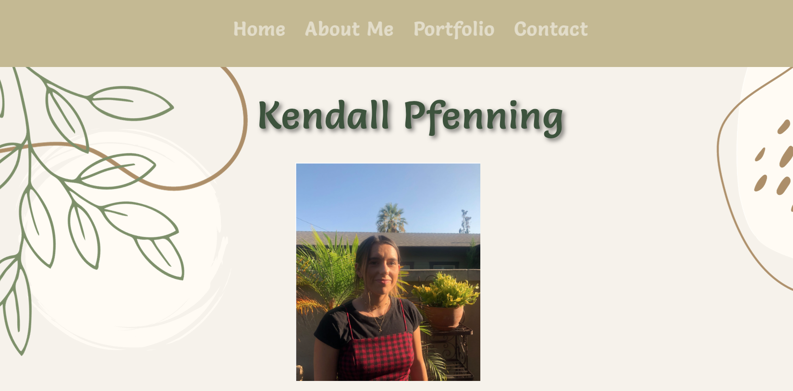

# Kendalls-React-Portfolio

## Description 

This is my portfolio built with React. It is a single page application that displays my projects and information about me. It showcases the skills I have developed with React. 

## Installation 

- Clone the repo onto your local machine
- Run npm install
- Run npm start
- Portfolio will then run on localhost:3000

## Screenshots

## License

This project is licensed under the MIT License.

## Connect

If you would like to contact me, find me on [Github](https://github.com/kendallp) or email me at <kendallpfenning@gmail.com>.